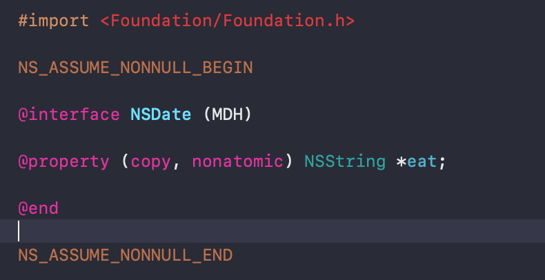
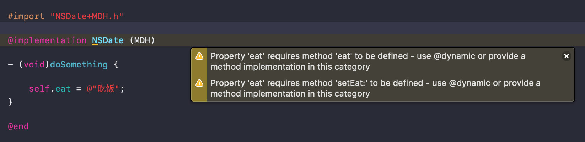
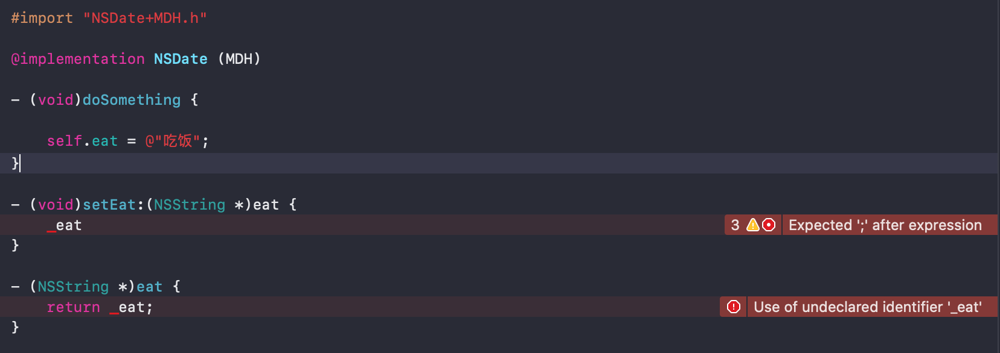
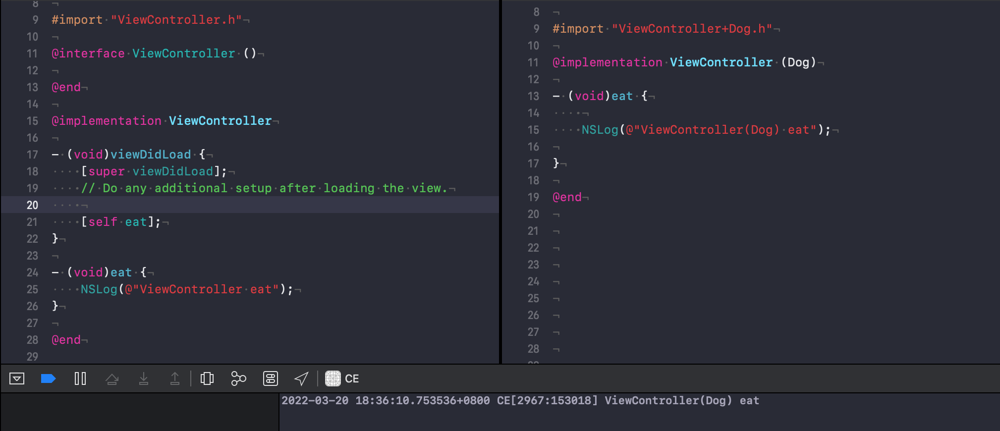
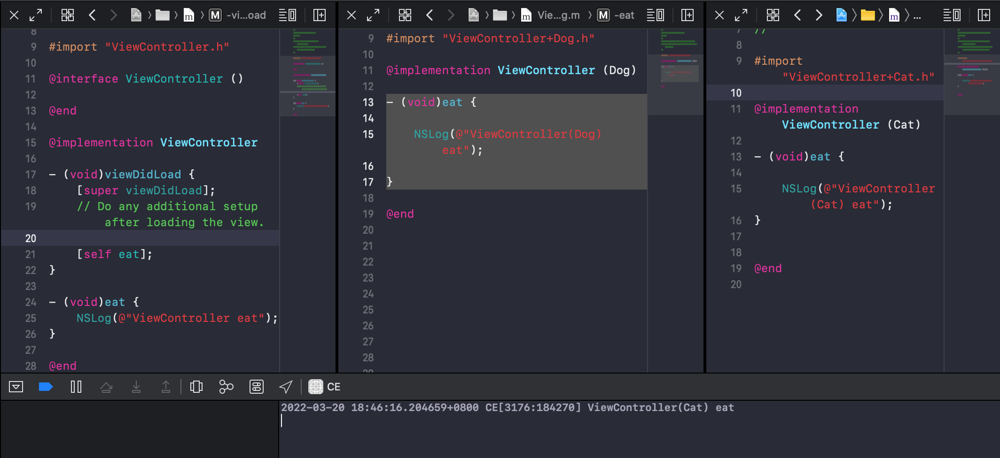
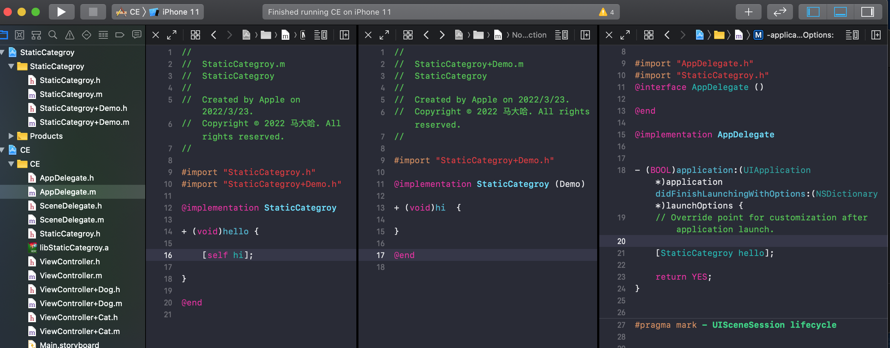
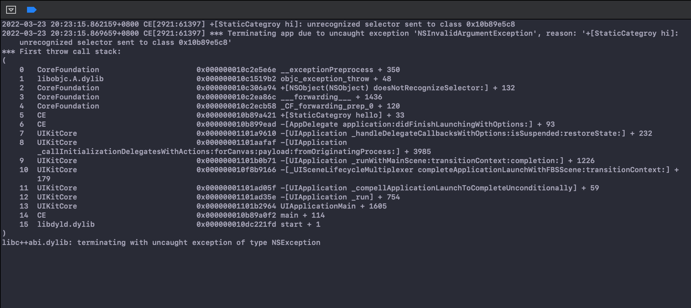

#Category & Extention

##Category

**面试题**

* 使用场景
* 劣势
* 在静态库与动态库中使用需要注意什么
* Category的实现原理，以及Category为什么只能加方法不能加属性。
* 复写本类方法会怎样
* Category中有load方法吗？load方法是什么时候调用的？load 方法能继承吗？load、initialize的区别，以及它们在category重写的时候的调用的次序。
* 在主工程中使用 & 在静态库中使用 & 在动态库中使用区别

**使用场景**

* 给现有的类添加方法；
* 将一个类的实现根据不同功能拆分成多个独立的源文件，减少单个文件的体积;
* 声明私有的方法。

**劣势**

* 多人协作**插件化**易造成分类名字冲突，导致编译报错
* 多人协作易造成方法冲突，导致执行过程中出现错误结果
* 复写本类方法导致本类方法无法执行


**Category的实现原理，以及Category为什么只能加方法不能加属性**

* 分类的实现原理是将category中的方法，属性，协议数据放在category\_t结构体中，然后将结构体内的方法列表拷贝到类对象的方法列表中。
* Category可以添加属性，但是只会生成setter和getter的声明,并不会自动生成成员变量及set/get方法的实现。因为category_t结构体中并不存在成员变量。
* 成员变量是存放在实例对象中的，并且编译的那一刻就已经决定好了。而分类是在运行时才去加载的。那么我们就无法再程序运行时将分类的成员变量中添加到实例对象的结构体中。因此分类中不可以添加成员变量。

```
进入分类的文件目录，执行 命令 【xcrun -sdk iphoneos clang -arch arm64 -rewrite-objc ViewController+Cat.m】或 【clang -rewrite-objc ViewController+Cat.m】然后生成 ViewController+Cat.cpp 文件，打开cpp文件即可找到 

struct _category_t {
	const char *name;// 类的名字  
	struct _class_t *cls; // 类 
	const struct _method_list_t *instance_methods;// 实例方法
	const struct _method_list_t *class_methods;// 类方法
	const struct _protocol_list_t *protocols;// 协议 
	const struct _prop_list_t *properties; // 属性
};


```





```
并且我们发现分类结构体中是不存在成员变量的，因此分类中是不允许添加成员变量的。分类中添加的属性并不会帮助我们自动生成成员变量，只会生成get set方法的声明，需要我们自己去实现。

Property 'eat' requires method 'eat' to be defined - use @dynamic or provide a method implementation in this category
Property 'eat' requires method 'setEat:' to be defined - use @dynamic or provide a method implementation in this category

```

```
可以使用runtime去实现category为已有的类添加新的属性并生产getter和setter方法。
- (void)setName:(NSString *)name
{
    objc_setAssociatedObject(self, @selector(name), name, OBJC_ASSOCIATION_COPY_NONATOMIC);
}

- (NSString *)name{
    return objc_getAssociatedObject(self, _cmd);
}
```

**复写本类方法场景**

添加方法列表的时候是后添加的在新形成的列表前部，这也是为什么在有多个category中有同名方法时，后编译的在调用时会“覆盖”前面已编译的方法。
其实方法本身并没有被覆盖，而是优先调用。调用的时候是从上而下查找方法列表，当运行时找到对应的方法名后就去忙着调用了，并不会管后面的同名方法。本类的方法依然在内存中的。




编译过程警告

```
只有 ViewController 和 ViewController （Dog）
ld: warning: instance method 'eat' in category from /Users/apple/Library/Developer/Xcode/DerivedData/CE-citmlzifvheenbdsgaprlfogqdbz/Build/Intermediates.noindex/CE.build/Debug-iphonesimulator/CE.build/Objects-normal/x86_64/ViewController+Dog.o overrides method from class in /Users/apple/Library/Developer/Xcode/DerivedData/CE-citmlzifvheenbdsgaprlfogqdbz/Build/Intermediates.noindex/CE.build/Debug-iphonesimulator/CE.build/Objects-normal/x86_64/ViewController.o

只有 ViewController 和 ViewController （Dog） 和 ViewController （Cat）
ld: warning: instance method 'eat' in category from /Users/apple/Library/Developer/Xcode/DerivedData/CE-citmlzifvheenbdsgaprlfogqdbz/Build/Intermediates.noindex/CE.build/Debug-iphonesimulator/CE.build/Objects-normal/x86_64/ViewController+Cat.o overrides method from class in /Users/apple/Library/Developer/Xcode/DerivedData/CE-citmlzifvheenbdsgaprlfogqdbz/Build/Intermediates.noindex/CE.build/Debug-iphonesimulator/CE.build/Objects-normal/x86_64/ViewController.o
ld: warning: instance method 'eat' in category from /Users/apple/Library/Developer/Xcode/DerivedData/CE-citmlzifvheenbdsgaprlfogqdbz/Build/Intermediates.noindex/CE.build/Debug-iphonesimulator/CE.build/Objects-normal/x86_64/ViewController+Dog.o overrides method from class in /Users/apple/Library/Developer/Xcode/DerivedData/CE-citmlzifvheenbdsgaprlfogqdbz/Build/Intermediates.noindex/CE.build/Debug-iphonesimulator/CE.build/Objects-normal/x86_64/ViewController.o
ld: warning: instance method 'eat' in category from /Users/apple/Library/Developer/Xcode/DerivedData/CE-citmlzifvheenbdsgaprlfogqdbz/Build/Intermediates.noindex/CE.build/Debug-iphonesimulator/CE.build/Objects-normal/x86_64/ViewController+Dog.o conflicts with same method from another category
```


**load 和 initialize**

load方法会在程序启动就会调用，当装载类信息的时候就会调用。load方法可以继承。优先调用类的load方法，之后调用分类的load方法。

区别在于调用方式和调用时刻
调用方式：load是根据函数地址直接调用。initialize是通过objc_msgSend（通过消息发送机制）调用，因此先找到分类方法中的实现，会优先调用分类方法中的实现。
调用时刻：load是runtime加载类、分类的时候调用（只会调用1次），initialize是类第一次接收到消息的时候调用，每一个类只会initialize一次（父类的initialize方法可能会被调用多次）

调用顺序：先调用类的load方法，先编译那个类，就先调用load。在调用load之前会先调用父类的load方法。分类中load方法不会覆盖本类的load方法，先编译的分类优先调用load方法。initialize先初始化父类，之后再初始化子类。如果子类没有实现+initialize，会调用父类的+initialize（所以父类的+initialize可能会被调用多次），如果分类实现了+initialize，就覆盖类本身的+initialize调用。

 
 
 ##Extention
 
* extension可以添加实例变量
*  一般用来隐藏类的私有信息（私有属性或方法），必须有一个类的源码才能为一个类添加extension，无法为系统的类比如NSString添加extension
* extension在编译期决议，它是类的一部分

```
以下是一个类的 .m 实现文件 

#import "ViewController.h"

--------------------------这就是扩展---------------------------
@interface ViewController ()
//私有属性
@property (copy, nonatomic) NSString *dog;
//私有方法（如果不实现，编译时会报警,Method definition for 'XXX' not found）
- (void)eatFood;
@end
------------------------------------------------------------


@implementation ViewController

- (void)viewDidLoad {
    [super viewDidLoad];
    // Do any additional setup after loading the view.
    
}

```

**在主工程中使用 & 在静态库中使用 & 在动态库中使用区别**


| 动态库  | 静态库  | 主工程 |
|:------------- |:---------------:| -------------:|
| 直接创建使用即可 | 可以直接创建且编译不报错；<br>当引入主工程后编译不报错，一旦调用静态库中Category函数即崩溃；<br>当引入动态库中效果雷同直接引入主工程 | 直接创建使用即可 |

```
当引入主工程，修改配置：目标工程的target的"Build Settings"中的“Other Linker Flags”选项添加“-all_load” 或 “-ObjC”

当引入动态库，动态库同样需要修改配置同上

```





为什么会崩溃？

```
看看苹果怎么写的
What causes those exceptions?
An impedance mismatch（不匹配的意思） between UNIX static libraries and the dynamic nature of Objective-C can cause category methods in static libraries to not be linked into an app, resulting in "selector not recognized" exceptions when the methods aren't found at runtime.
（静态库与OC的动态特性产生了不匹配，引起在静态库中的分类方法没有被链接进入app）

静态库中的分类方法没有被链接进app，导致在运行时找不到这个方法，然后控制台输出“selector not recognized”进而崩溃

```


 ##参考资料


```
https://www.jianshu.com/p/fa66c8be42a2
https://www.jianshu.com/p/b7f3eaac9172

```

